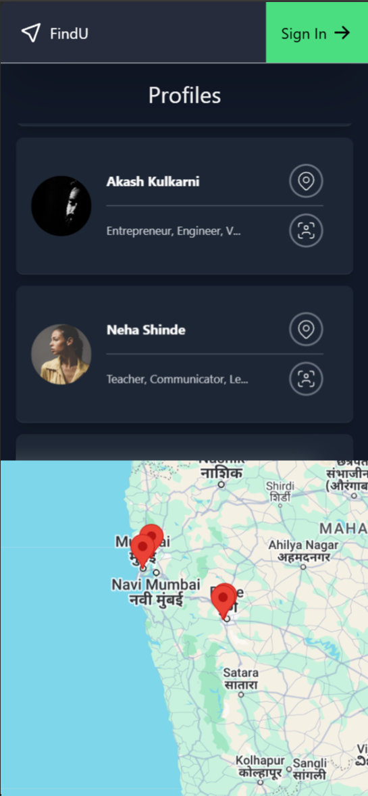
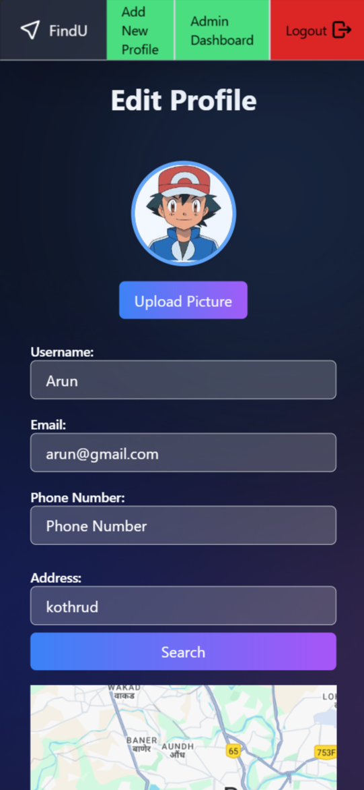
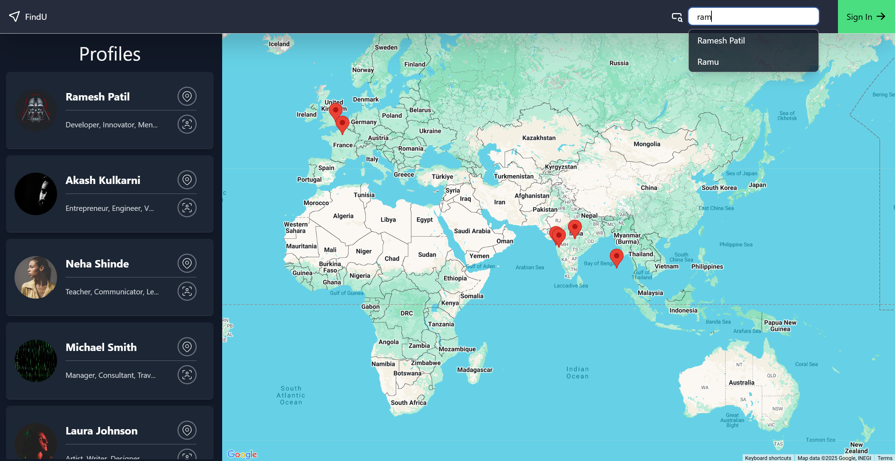

# Profile Mapping Web Application

This web application allows users to view a list of profiles and explore their geographic locations interactively on a map. It is built with **React** for the frontend and **Node.js (Express)** for the backend.

## Showcase

Watch the project in action:

[](https://youtu.be/MIIh4ow-ufI)

#### Mobile UI

<div style="display: flex; justify-content: space-between;">
  
  
</div>

#### PC UI

<div style="display: flex; justify-content: space-center; width:100vw;">

</div>

## Prerequisites

Before you begin, make sure you have the following installed:

- [Node.js](https://nodejs.org/) (preferably the latest LTS version)
- npm (comes with Node.js)

Credentials for login to add/edit/delete profiles

```json
{
    username:admin,
    password:admin
}
```

## Project Setup

### 1. Clone the Repository

Clone the project to your local machine:

```bash
git clone https://github.com/your-username/project-repo-name.git
cd project-repo-name
```

### 2. Set Up the Frontend

Navigate to the root folder and install the dependencies for the frontend:

```bash
npm install
```

### 3. Set Up the Backend

Go to the Backend folder and install the dependencies for the backend:

```bash
cd Backend
npm install
```

### 4. Configure API Key for Google Maps

To enable Google Maps functionality, you need to input your Google API key.

In the root folder, open src/App.jsx.

Find the line where the Google Maps API key is used (googleAPIKey).

### 5. Running the Application

Now, open two separate terminal windows to run the frontend and backend simultaneously.

#### 5.1 Run Frontend (React):

In the root folder, run the following command to start the frontend development server:

```bash
npm run dev
```

#### 5.2 Run Backend (Node.js):

From the root folder, run the following to start the backend server:

```bash
cd Backend
node .\app.js
```

### 6. Access the Application

Once both the frontend and backend are running, open your browser and go to:

http://localhost:5173/

# Additional Notes

```The backend uses JWT for authentication.
The Google Maps API is used to display geographic locations for each profile.
License
This project is licensed under the MIT License - see the LICENSE file for details.
```
